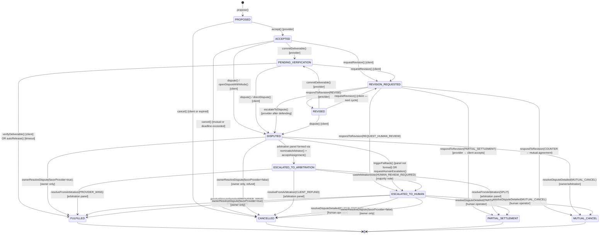

# ARC-402 Agreement State Machine

This document describes all valid states, transitions, and terminal states for a `ServiceAgreement`.

---

## Status Enum

| Value | Name | Description |
|-------|------|-------------|
| 0 | `PROPOSED` | Agreement proposed by client, awaiting provider acceptance |
| 1 | `ACCEPTED` | Provider accepted; work in progress |
| 2 | `PENDING_VERIFICATION` | Provider committed deliverable; in client verification window |
| 3 | `FULFILLED` | Deliverable accepted or auto-released; escrow paid out |
| 4 | `DISPUTED` | Formal dispute opened; awaiting arbitration assignment |
| 5 | `CANCELLED` | Agreement cancelled before acceptance or by mutual agreement |
| 6 | `REVISION_REQUESTED` | Client requested revision during remediation cycle |
| 7 | `REVISED` | Provider submitted revised deliverable |
| 8 | `PARTIAL_SETTLEMENT` | Parties agreed to a partial payout split |
| 9 | `MUTUAL_CANCEL` | Both parties agreed to cancel; escrow refunded |
| 10 | `ESCALATED_TO_HUMAN` | Dispute escalated to human backstop queue |
| 11 | `ESCALATED_TO_ARBITRATION` | Dispute assigned to on-chain arbitration panel |

---

## Terminal States

These states cannot transition further:

- `FULFILLED` (3) — work complete, escrow released
- `CANCELLED` (5) — agreement voided
- `PARTIAL_SETTLEMENT` (8) — agreed partial payout executed
- `MUTUAL_CANCEL` (9) — mutual cancellation executed

---

## State Transition Diagram

---

## Transition Summary Table

| From | To | Trigger | Who |
|------|----|---------|-----|
| PROPOSED | ACCEPTED | `accept()` | Provider |
| PROPOSED | CANCELLED | `cancel()` or `expiredCancel()` | Client or anyone after deadline |
| ACCEPTED | PENDING_VERIFICATION | `commitDeliverable()` | Provider |
| ACCEPTED | REVISION_REQUESTED | `requestRevision()` | Client |
| ACCEPTED | DISPUTED | `dispute()` / `openDisputeWithMode()` | Client |
| ACCEPTED | CANCELLED | `cancel()` | Either party (mutual) or expired |
| PENDING_VERIFICATION | FULFILLED | `verifyDeliverable()` or `autoRelease()` | Client or anyone (timeout) |
| PENDING_VERIFICATION | REVISION_REQUESTED | `requestRevision()` | Client |
| PENDING_VERIFICATION | DISPUTED | `dispute()` / `directDispute()` | Client |
| REVISION_REQUESTED | REVISED | `respondToRevision(REVISE)` | Provider |
| REVISION_REQUESTED | PARTIAL_SETTLEMENT | `respondToRevision(PARTIAL_SETTLEMENT)` → accepted | Provider → Client |
| REVISION_REQUESTED | MUTUAL_CANCEL | mutual agreement via revision cycle | Both |
| REVISION_REQUESTED | ESCALATED_TO_HUMAN | `respondToRevision(REQUEST_HUMAN_REVIEW)` | Provider |
| REVISION_REQUESTED | DISPUTED | `escalateToDispute()` | Provider |
| REVISED | PENDING_VERIFICATION | `commitDeliverable()` | Provider |
| REVISED | REVISION_REQUESTED | `requestRevision()` (next cycle) | Client |
| REVISED | DISPUTED | `dispute()` | Client |
| DISPUTED | ESCALATED_TO_ARBITRATION | Panel formed via `nominateArbitrator()` + `acceptAssignment()` | Parties + arbitrators |
| DISPUTED | ESCALATED_TO_HUMAN | `triggerFallback()` (panel timeout) or `requestHumanEscalation()` | Anyone / Client |
| DISPUTED | FULFILLED / CANCELLED | `ownerResolveDispute()` | Owner only |
| ESCALATED_TO_ARBITRATION | FULFILLED / CANCELLED / PARTIAL_SETTLEMENT | `resolveFromArbitration()` (via castArbitrationVote majority) | Arbitration panel |
| ESCALATED_TO_ARBITRATION | ESCALATED_TO_HUMAN | `castArbitrationVote(HUMAN_REVIEW_REQUIRED)` majority | Arbitration panel |
| ESCALATED_TO_HUMAN | FULFILLED / CANCELLED / PARTIAL_SETTLEMENT / MUTUAL_CANCEL | `resolveDisputeDetailed()` or `ownerResolveDispute()` | Human operator / Owner |

---

## Notes

- **Direct dispute** (`directDispute()`) skips remediation entirely for hard-failure reasons: `NO_DELIVERY`, `HARD_DEADLINE_BREACH`, `INVALID_OR_FRAUDULENT_DELIVERABLE`, `SAFETY_CRITICAL_VIOLATION`.
- **Auto-release** happens automatically when the verification window expires without client action. No explicit transaction needed.
- **Arbitrator bonds** (posted via `acceptAssignment()`) are returned on clean resolution and slashed on no-show or missed deadline. Arbitrators can reclaim expired bonds after 45 days via `reclaimExpiredBond()`.
- **Emergency freeze** via `PolicyEngine.freezeSpend()` does not change agreement status but blocks any new spend from the frozen wallet while a dispute is active.
